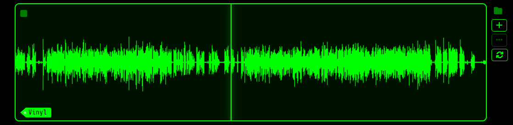

# GrooveDropper

   Welcome to GrooveDropper, a random "needle drop" sample picker. 



This application is designed to randomly pick samples from your sample library, 
which could be digital vinyl recordings, melodics, whole songs, whatever you 
want to randomly pick from. 
It will pick a wave file at random and randomly plays a section in the
sample, hence the "needle dropping". 

When you lack inspiration and like to use sources like [samplette.io](https://samplette.io/), and
are inspired by the randomness of the samples you can pick from, this 
tool might work for you.

❤️ This application is a labor of love and I created this application as I 
could not find a single tool that actually randomizes sample selection, support 
some tagging and allow me to dig through thousands of sample chops I collected 
over the years.

## FAQ

- Is GrooveDropper free? — Yes, it is created in my spare time, and I will 
  work on it when time allows.
- Is GrooveDropper local? — Yes it is 100% local, it runs python (Flask) and 
  uses SQLite for the indexing and a web front-end.
- Are my samples safe? — Yes, it only indexes them and builds the database 
  and plays the samples, you cannot edit / delete them accidentally
- Can I contribute? — Yes, just file a ticket and make sure you clarify the 
  bug, or the feature you want
- Why do I have to give a database location? — Because some flavors of Python 
  (on Windows) virtualize everything and the database location will end up 
  in a hidden folder in `%APDATA%` which makes it hard to copy or backup.

## Features

- Lets you randomize a sample based upon the indexed samples, or randomize 
  in the sample itself
- You can index multiple folders, and auto-label the folders
- You can go back in history if you liked a sample that played in the past
- You can change the pitch on the fly to play with the key to see if it matches 
  your song
- You can add or edit tags to filter the random picking
- You can add presets which toggle on or off a set of labels
- You can add the samples you find to a vibe list, to group together 
  matching samples and pitches
- The links are sharable, which means the URL that you copy out could work 
  for someone else (if they have the same sample), or from a note if a chop 
  matches a future song 
- The randomly selected sample drop location can be exported out as a 
  sample slice and downloaded to import into your sampler or DAW.

Check [the manual](docs/USER-MANUAL.md) for a more in depth guide. 

## Usage

This project consists of a Python backend (Flask API + SQLite database) and 
a web front-end. It also has an Electron wrapper application that packages the 
whole thing into a standalone GUI (in beta). 

### Running from source

You can run the Flask app via the command line. It will automatically open a tab in your default web browser.

**Windows** — install Python if you haven't already:

```bat
> winget install python
```

Then run from the project directory:

```bat
> run.bat c:\users\{yourname}\groovedropper.db --db-file {path-to-database}\groovedropper.db
```

The batch file creates a virtual environment and installs all required packages automatically.

**Linux / macOS** — install Python 3 via your package manager if needed (e.g. `sudo apt install python3` on Ubuntu/Debian), then:

```bash
> chmod +x run.sh
> ./run.sh ~/groovedropper.db
```

The shell script handles the virtual environment the same way the batch file does.

### Running as an Electron App

⚠️ This is still untested, but it should work.

#### Developer Setup

1. **Install Node.js** (includes `npm`) if you haven't already.
2. **Install Python dependencies:**
   ```bash
   pip install -r requirements.txt
   ```
3. **Install Node dependencies:**
   Navigate to the project root and install the required electron libraries:
   ```bash
   npm install
   ```
4. **Start the App:**
   ```bash
   npm start
   ```

When you start the app for the first time, it will prompt you to select the folder where you keep your long `.wav` files. The SQLite database will be automatically created in your user's AppData/Roaming folder (or the equivalent OS-specific user data folder).

#### End-User Installation (Compiled App)
*If you plan to package this app using electron-packager or electron-builder for end users, they will not need to touch the command line.*

1. Run the `.exe` (Windows), `.app` (Mac), or binary (Linux).
2. The application will ask you to select a directory containing your long `.wav` audio files.
3. The app will scan your files, generate waveforms, and you can immediately start chopping!

Once the browser opens, use the **Add Folder** button in the UI to point GrooveDropper at your directory of `.wav` files. Folders and their labels are managed through the web interface and persisted in the database.

* `--db-file`: The SQLite database file (e.g. `groovedropper.db`). This file will be created if it does not exist.
* `--port` *(optional)*: Port to serve the app on (default is 5000).
* `--refresh` *(optional)*: Pass this flag to drop all existing data and rescan everything from scratch.
* `--no-browser` *(optional)*: Start the server without opening a browser tab.

## AI disclaimer

I am a developer by profession for 30+ years, and I am adept in Python 
(since 2.7). However, due to time constraints and lack of knowledge in CSS + 
Javascript, I used Claude to generate most of the front-end, and some of the 
code generated in the back-end, but I made sure to review it all. This project 
took me a few weeks to make, which otherwise would have taken many months. I 
take code quality very seriously and only accept changes which I understand 
myself.

## Built With
- **Python / Flask** - Backend API and static file server.
- **SQLite** - Fast, local, file-based database for tracking files and history.
- **Soundfile / Numpy / Pillow** - For analyzing audio and generating the custom waveform images.
- **Electron** - Cross-platform wrapper to give the app a desktop UI.
- **HTML / Vanilla JS / CSS** - The front end. No heavy frameworks!