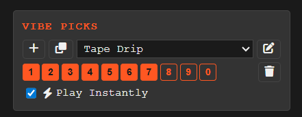

# User Manual

GrooveDropper is **100% local**. It runs entirely on your machine. No 
accounts, no cloud, no subscriptions, no phone-home. 
Your sample library is never modified: the app only reads your files to build
a searchable index and stream audio for playback.

## Contents

1. [Getting Started](#getting-started)
2. [Keyboard Shortcuts](#keyboard-shortcuts)
3. [Digging for Samples](#digging-for-samples)
4. [Sharing & Saving](#sharing--saving)
5. [Pitch Control](#pitch-control)
6. [Labels & Presets](#labels--presets)
7. [Vibe Picks](#vibe-picks)
8. [Themes](#themes)
8. [Database Migration Policy](#database-migration-policy)
9. [Troubleshooting](#troubleshooting)

---

## Getting Started

When you launch GrooveDropper for the first time the library database is empty. 
The first step is to point it at a folder of WAV files.  

Click the **folder `+` button** in under the waveform view to open the *Add 
Scan Folder* dialog. Enter the path to your samples folder, 
and click on an optional label (e.g. "Breaks", "Melodics", "Chops"), and click 
**Scan**. GrooveDropper walks the folder recursively, indexes every `.wav` 
file it finds, and generates waveform thumbnails in the background, and 
calculates a unique digest to make sure no doubles are added.

⚠️ You can only select folders to be scanned this way as dragging and 
dropping a folder does not work in a web browser. If you want to have other 
labels to classify, please create them first before adding a folder.

You can add as many folders as you like. Each folder can carry its own 
auto-label so every file from that folder is tagged automatically, which is A 
quick way to categorize a whole collection in one go. Once the scan 
finishes the waveform will be available upon the next randomization.

### Notes on scanning

- When you quit the application when scanning, it will pick up where it left.
- When you move samples around, they will retain their tag information as 
  long as the sample data is unaltered 
- When new samples are added to a monitored folder, they will be added upon 
  restart, or when you press the refresh button under the waveform view
- It doesn't matter that folders overlap as every WAV that is added is 
  checked and if the same wav file (per digest) is found, it will not add 
  the same files again.

---

## Keyboard Shortcuts

- Sample playback
  - `Space` — Play / Pause (see [Play and Pause](#play-and-pause))
  - `Shift + Space` — Reset play head to the original randomized position
  - `Ctrl + Space` — Mark current position as the new slice / restart origin (playhead flashes; does not interrupt playback)
  - `Home` — Jump to the absolute beginning of the sample (offset 00000000)
  - `R` — Pick a new random sample and play immediately (see [Digging for 
    Samples](#digging-for-samples))
  - `Shift + R` — Randomize the play head offset within the current sample
  - `P` — Go back in history
  - `Click` waveform — Scrub to clicked position
- Tuning
  - `,` / `.` — Pitch down / up 1 semitone; hold `Shift` for 10-cent fine 
    steps (see [Pitch Control](#pitch-control))
  - Dragging with mouse over the pitch controls also works
  - `/` — Reset pitch to zero
- Sharing
  - `L` — Copy a direct URL for the current sample and offset (see 
    [Sharing & Saving](#sharing--saving))
  - `S` — Save a 10-second slice from the current playhead position
  - `Ctrl + Click` on the file or folder icon copies the full file path to 
    clipboard to manipulate or find the sample locally
- Vibe list
  - `Shift + 1`–`0` — Save current sample to a specific quick pick slot 1 – 10
  - `1`–`9` / `0` — Recall quick pick slot 1 – 10
  - `V` — Store current sample and offset to the next free quick pick slot
  - `Arrow Left` / `J` — Navigate to the previous filled quick pick slot
  - `Arrow Right` / `K` — Navigate to the next filled quick pick slot

---

## Digging for Samples

This is the main interface window. The play head will show an approximation 
of where the sample is playing from, but since it is a small image, there it 
is imprecise for large samples.

### Picking a random sample

Press **`R`** to have GrooveDropper pick a random file from your library 
and drop the needle at a random offset. It plays immediately, no clicking 
required.

### Randomize within the sample

If you are digging the sample, but you want to explore more part of it, press 
**`Shift + R`** to stay on the same file but jump to a different random 
positions. This is useful when a sample sounds promising but the current 
chop is not what you want.

It is also nice to use this method to record the glitchiness directly into a 
sampler for unpredictable results. 

### Play and pause

**`Space`** toggles playback. After scrubbing around, press **`Shift + Space`** 
to snap the playhead back to the position where the needle originally landed, 
and resume from there.

The sample can be started and stopped, but it will always remember the 
picked (or clicked) offset, you can reset it to this offset even when it is 
stopped with **`Shift + Space`**

### Scrub with the mouse

Click anywhere on the waveform to jump to that position, in playback mode 
this will immediately let you listen what is there, clicking in the 
waveform also counts as a new offset. And **`Shift + Space`** will reset to 
that location.

### Navigate history

GrooveDropper remembers everything you've heard in the session.
Press **`P`** to step back through history.

⚠️ Pressing **`R`** will void all history that comes after the last selected 
sample.

---

## Sharing & Saving

### Sharing a link

Press **`Ctrl + Space`** to copy a direct URL to your clipboard. The link 
encodes MD5 digest of the file, the play offset position (and if pitch is 
changed, as well), so you can:

- Paste it into a note-taking tool (Notion, Obsidian, Bear, …) to build a 
  running list of samples that inspires you for a song and recall them by 
  clicking on the link when GrooveDropper runs
- Send it to a friend. If they have the same sample library indexed locally, 
  the link opens at the exact same spot with the same pitch applied.

Because of the MD5 digest, it does not matter how often you reindex your 
database, or where the sample ends up, as long as the data of the sample is 
unaltered, it will always be found. 

Without pitch information, the link will look like:
- `http://127.0.0.1:5000/?sample=801730016a4a44d2f18c8538daad086e&start=4216491`  

When pitch is applied, the link will look like:  
- `http://127.0.0.1:5000/?sample=801730016a4a44d2f18c8538daad086e&start=4216491&pitch=2&cents=20`

Opening a link with `pitch=` and/or `cents=` parameters will automatically 
restore 
the pitch to those values when the sample loads.

### Copying file details

Each metadata field in the sample info panel has a small icon to its left. 
Hovering over it reveals a tooltip; clicking it copies the corresponding value 
directly to your clipboard and shows a brief toast confirmation.

This can be useful to find the location of a sample or the name for later use.

| Property  | Copies                                               |
|-----------|------------------------------------------------------|
| Name      | The filename of the sample (e.g. `BREAK_120BPM.wav`) |
| Directory | The full folder path on disk                         |
| Size      | The formatted file size (e.g. `4.2 MB`)              |
| Duration  | The formatted duration (e.g. `0:03.4`)               |
| Offset    | The zero-padded sample offset (e.g. `00043050`)      |

This is handy for quickly building filenames, noting where a sample lives, or 
pasting an offset into another tool without having to select and copy the text 
manually.

### Saving a slice

Press **`S`** to export a 10-second WAV clip starting from the randomized 
start offset (this is not the current offset where the play head stopped). The 
file downloads straight to your browser's download folder, ready to drag 
into your sample or a DAW.

If the sample was pitched up or down, this information is also saved to the 
sample name. For example if the sample is pitched down 3 semitones and 10 
cents, it will be exported as: `SAMPLE_0045342_-3p10c.wav`. This will allow 
you to reconstruct the pitch in your DAW or sampler by inspecting the filename.

---

## Pitch Control

Use the pitch controls to transpose on the fly and audition a sample  
against the key you're working in, without leaving the app.

| Key       | Action                                                          |
|-----------|-----------------------------------------------------------------|
| `,` / `.` | Pitch down / up 1 semitone; hold `Shift` for 10-cent fine steps |
| `/`       | Reset pitch to zero                                             |

Use your mouse to drag over the semitones or cents to control the pitch by 
mouse.

**NOTE:** A cent is 100 steps in a semitone, so after pitching up or down 90 
cents, it will reset to 00 and increase or decrease the semitone value. 

**Important:** pitch adjustment is handled by the browser's audio engine 
and is not baked into the [exported slice](#saving-a-slice). Exporting at a 
shifted pitch would involve resampling that introduces audible or 
different artifacts, so GrooveDropper intentionally saves the clip at its 
original pitch. Transpose it in your DAW after importing.

---

## Labels & Presets

- The checkbox in front of the label will add the label to the current 
  sample, and it will be displayed under the waveform as well.
- Clicking the label will highlight it, and the next randomized sample will 
  be picked from the categories that are highlighted (the count behind the 
  label will show how many samples are in this category)
- The ALL preset will reset all labels to dimmed so that all samples match
- If you added a preset by hand, clicking that preset will highlight the 
  labels in that preset
- The special **UNTAGGED** entry at the top of the list restricts **`R`** to
  samples that have no labels at all — see [The UNTAGGED filter](#the-untagged-filter)

### Labelling samples

Click the `+` button in the **Labels** panel to create a label. Toggle a 
label on or off for the currently loaded sample by clicking it. Labels are 
stored by MD5 digest, if you move a file to a different folder and rescan, 
all its labels are automatically restored (unless you explicitly delete it).

### Filtering with labels

When one or more labels are active, random picks are restricted to files 
that carry **at least one** of those labels (OR logic). Select "Soul" and
"Funk" and you'll get files tagged with either. In the future maybe and 
logic might be added but for now just include what you need is best.

### The UNTAGGED filter

Directly below the **Labels** header sits a special **UNTAGGED** entry. It 
cannot be edited or assigned to samples. Its count badge shows how many 
samples in your library currently carry **no labels at all**.

Click **UNTAGGED** to activate it as a toggle:

- All other label selections are cleared while UNTAGGED is active.
- Pressing **`R`** now randomizes exclusively over your unlabeled samples.
- Click **UNTAGGED** again — or click any regular label or preset — to
  deactivate it and return to normal filtering.

This is handy for working through an "inbox" of uncategorized samples: activate
UNTAGGED, hit **`R`** repeatedly, and tag each sample as you go. The count
updates live as you label samples so you can see your inbox shrink.

### Presets

A preset is a saved snapshot of a label selection. Type a name into the 
preset field and click `+` to save the current active labels as a preset. 
Clicking a preset later restores that exact label combination in one shot which 
is handy for quickly switching between "Drums only", "Keys only", or any other 
mood that you feel at the moment.

---

## Vibe Picks

The vibe pick window looks like this:

A vibe pick is used when you're randomly selecting samples, and you dig how 
they sound together. It could be a break, a vocal or a melodic. 

You can see a vibe list as a sketch list for samples you would like to 
export together, for example:

- You find a melodic that you really like, add it to a slot with the proper 
  pitch
- Now to find drums you categorized so you select `< ⸰ DRUMS` as a label and 
  randomize until you find a break, add this to a vibe 
- Now select `< ⸰ VOCALS` and find a cool phrase
- Also, you can paste a bookmark (see [sharing a link](#sharing-a-link)) and 
  add this to a vibe later

Just start pressing `V` to create a new list and assign the current sample, 
offset and pitch to this slot, or press `Shift` + `1 - 0` to assign a free 
slot. Pressing `1 - 0` will recall this slot if occupied, and select it as a 
focused item.

When it is focused (e.g. selected), you can change the pitch and it will 
automatically save it to the picked slot, so that you do not have to re-add 
the slot.

Pressing `+` will create a new list, and pressing the clone button will 
clone the current list.

Why cloning? If you are digging a vibe, but stumble upon a new sample that 
takes you down a rabbit hole, clone the list and continue altering it so 
that you can remove the samples that do not match the new path, but keep all 
other presets.

---

## Themes

GrooveDropper ships with a default theme and a dark **hacker** theme, 
and a **soundtracker** theme.

Switch themes using the theme toggle in the interface.

---

## Database Migration Policy

The application has a migration policy with a crude versioning system which 
means after a new release, the application will migrate the database for you.
However it is always a good idea if you have manually tagged a lot of WAV 
files or have other information you do not want to lose, to make a backup of 
your database before running a new version.

This application comes with a MIT License, which means the software can be 
used "AS-IS" and without any warranty. I am not liable for your lost time, 
but I will try my best to not mess with your data 🙂 

---

## Troubleshooting

- **My new database location does not load** 
  - Make sure that no other version is running in the background, it might 
    interfere with the URL already being in use.
- **The first time my Python installation failed**
  - Fix the problem that is reported, but make sure you remove `.venv` in 
    your folder to restart the installation
- **The scan finishes but no samples appear.**
  - Check that the folder contains `.wav` files, GrooveDropper only indexes 
    WAV format (for now)
- **A file I moved is showing as missing.**
  - Re-add the folder at its new location and trigger a refresh. Because 
    labels are stored by an MD5 file hash, any tags you applied will be 
    picked up automatically once the file is reindexed.
- **Playback cuts out or sounds glitchy.**
  - This is usually a browser audio issue. Reload the page; if the problem 
    persists try a different browser.
